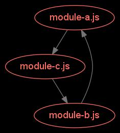

# Fuse-box and circular dependencies


## Aim of this repo

The aim of this repo is to understand :

Why requiring `module-c` after `module-a` end up with `ClassA` from `module-a` being `undefined` and why requiring in the reverse order end up with `ClassA` defined.
This behaviour **is not specific to fuse-box** and can be reproduced by running both tests which use typescript compiler in the background (no fusebox involved).

Also, I would love fuse-box to give feedback about such issues ; [madge](https://github.com/pahen/madge) helps gracefully with detecting circular dependencies. But what I find very disturbing is that build-tools don't seem to predictably know when undefined values could be imported. So I was thinking of a game-changer but possibly complex-to-implement feature that could detect when an imported value will result in undefined because of circular deps.

## Install and test

just run
```
yarn install
```
and
```
yarn test
```
